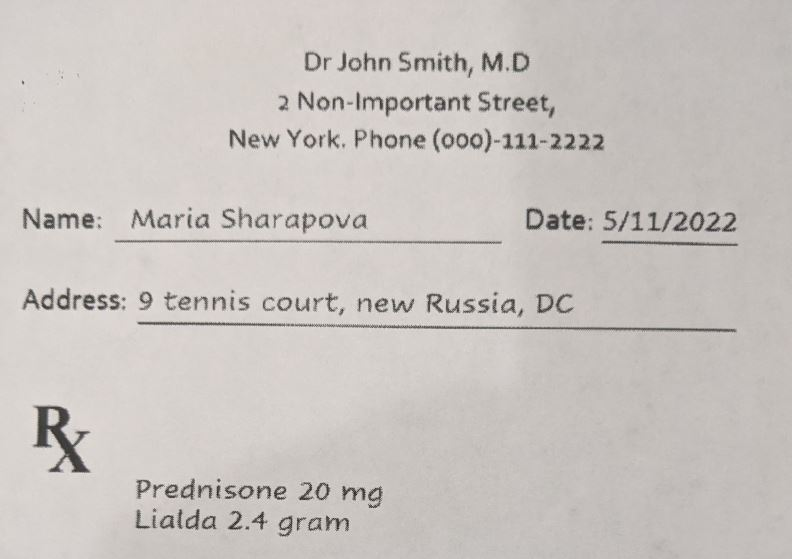

# Computer-vision-in-action

## Image processing in action

In this section I am trying to process an image. The 1st image (clear image) as it's name suggests is a clearer image upon which I've applied simple thresholding to generate a binary image

 See the image here (we will turn it into a binary image) 

 
The 2nd image (dark image) is a little complex, the image has got the user's mobile shadow who was trying to click this picture on his/her phone. Using the simple thresholding method we weren't getting the required binary image hence I used the adaptive thresholding method to generate the best possible binary image

 
